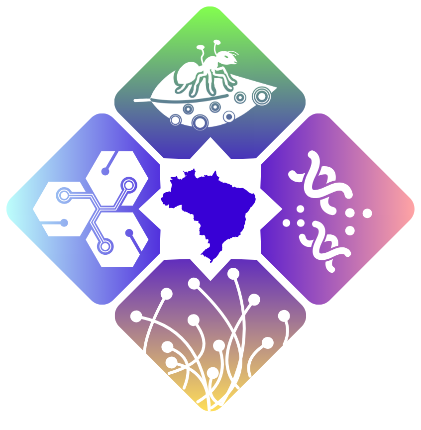

# Objetivos

## Objetivo Geral
Estabelecer a Rede INCT-Fungos do Brasil como um centro de excelência nacional e internacional em micologia, a fim de elucidar a biodiversidade, genômica, funcionalidade ecossistêmica e aplicações de fungos e organismos semelhantes a fungos em biomas e microhabitats brasileiros.

## Objetivos específicos
1. Contribuir para a formação de recursos humanos em nível de graduação e pós graduação. O INCT FUNGOS_BR é composto de pesquisadores que orientam em 39 Programas de Pós Graduação nas cinco diferentes regiões brasileiras. 
2. Contribuir para a formação continuada de pesquisadores e estudantes, principalmente em grupos de fungos negligenciados, através da oferta de disciplinas remotas de graduação e pós-graduação em micologia, biotecnologia fúngica e bioinformática aplicada oferecido por professores do Brasil e do exterior. 
3. Desenvolver cursos de curta duração e workshops avançados (on line e/ou presencial) para capacitação em metodologias *ômicas*, de culturoma, bioensaios, química e taxonomia de fungos. 
4. Estabelecer parcerias estratégicas com instituições líderes em micologia e biotecnologia fúngica em diferentes continentes e implementar um programa de mobilidade internacional para pesquisadores e estudantes do INCT-Fungos do Brasil. 
5. Fomentar e organizar congressos internacionais bienais sobre biodiversidade fúngica e suas aplicações biotecnológicas. 
6. Prospectar, identificar e caracterizar fungos com potencial biotecnológico em ecossistemas brasileiros e microhabitas contaminados por metais pesados e agrotóxicos, com especial atenção aos biomas Pantanal, Amazônia e Caatinga, para desenvolvimento de produtos para biorremediação. 
7. Prospectar, identificar e caracterizar fungos com potencial biotecnológico associados ou não à plantas endêmicas, dos biomas brasileiros, com especial atenção aos biomas Pantanal, Amazônia e Caatinga, visando o desenvolvimento de bioinsumos para promoção de crescimento de planta e controle de fitopatógenos. 
8. Prospectar, identificar e caracterizar fungos com potencial biotecnológico associados ou não a insetos dos diferentes biomas brasileiros, com especial atenção aos biomas Pantanal, Amazônia e Caatinga, para desenvolvimento de bioinsumos controle biológico de pragas. 
9. Caracterizar fungos associados a humanos e animais a fim de compreender a relação patógeno-hospedeiro, mecanismos de resistência, bem como avaliar novas formas de controle. 
10. Obter e analisar dados genômicos, transcriptômicos e proteômicos de linhagens fúngicas isoladas e caracterizadas com foco em fungos de interesse ambiental, agroflorestal, médico e veterinário, visando criar uma base de dados genômicos abrangente para estudos comparativos e aplicações biotecnológicas. 
11. Estabelecer um repositório genômico das espécies-tipo de fungos brasileiros depositados em herbários e coleções micológicas, visando preservar *in silico* os recursos genéticos da funga brasileira para a comunidade científica. 
12. Realizar o desbloqueio e/ou superexpressão de genes ou vias metabólicas de interesse biotecnológico, visando a obtenção de moléculas ou proteínas de interesse. 
13. Criar uma base nacional de conhecimento (*knowledge base*) para utilização local em modelos de inteligência artificial, cujos dados e análises serão disponibilizados de forma interativa para pesquisadores da biodiversidade brasileira. 
14. Estabelecer, sem redundâncias, uma infraestrutura integrada, unificada e automatizada análise de genomas, transcriptomas e proteomas, catalogação, análise, armazenamento e utilização dos dados moleculares gerados de espécies de fungos do Brasil 
15. Desenvolver o portal **TupiniMAIYCO**, uma base de conhecimento unificada com informações da biodiversidade de fungos em biomas brasileiros, integrando dados ecológicos, taxonômicos, evolutivos, filogeográficos, genômicos, moleculares e funcionais, interligado com coleções biológicas institucionais. 
16. Caracterizar os fungos tipo e os isolados de referência oriundos de ecossistemas brasileiros com especial atenção aos biomas Pantanal, Amazônia e Caatinga, para a obtenção dos dados genômicos. 
17. Consolidar o banco de fungos brasileiros do Fungos_BR para sua preservação *ex situ* bem como ser referência da biodiversidade de ecossistemas brasileiros com especial atenção aos biomas Pantanal, Amazônia e Caatinga em coleções de culturas e herbários de referência nacional. 
18. Aprimorar o conhecimento sobre o estado de conservação de espécies da Funga Brasileira. 
19. Estabelecer parcerias com setor privado para avaliação e validação de bioinsumos biológicos do INCT-Fungos do Brasil.
20. Elaborar e executar atividades de extensão para formação continuada de professores do ensino médio. 
21. Organizar e executar feiras de ciências com foco em Fungos Brasileiros para alunos do ensino médio e fundamental 
22. Publicar conteúdos sobre os resultados do projeto em mídias sociais: Instagram, Facebook, X e TikTok. 
23. Publicar os dados em revistas indexadas de circulação internacional 
24. Capacitar e estruturar rede de Cientistas Cidadãos para monitoramento de espécies ameaçadas em áreas de interesse através do aplicativo MIND.Funga 
25. Organizar e implementar o museo virtual de micologia do INCT Funga -Brasil 
26. Organizar e editorar livro sobre biodiversidade, genômica, e aplicações biotecnológicas de fungos brasileiros 
27. Analisar dados genômicos, transcriptômicos e proteômicos de linhagens fúngicas isoladas e caracterizadas com foco em fungos de interesse ambiental, agroflorestal, médico e veterinário, visando criar uma base de dados genômicos abrangente para estudos comparativos e aplicações biotecnológicas. 
28. Acessar a diversidade de fungos do solo nos diferentes biomas brasileiros utilizando métodos independentes de cultivo - *metabarcoding*.

## Metas

1. Formação de pelo menos 210 IC.
2. Formação de pelo menos 14 doutores nos 32 Programas de Pós Graduação em nível de doutorado que participam da proposta. 
3. Formação de pelo menos 35 mestrandos nos 39 Programas de Pós Graduação em nível de mestrado que participam da proposta. 
4. Formação de pelo menos 350 alunos de graduação em diferentes graduações de instituições de ensino superior no Brasil. 
5. Formação de pelo menos 175 alunos de pós-graduação em diferentes Programas de Pós Graduação. 
6. Capacitação de pelo menos 280 profissionais ao final do projeto. 
7. Intercâmbio de pelo menos 7 estudantes para realização de doutorado sanduíche. 
8. Capacitação de pelo menos 6 pós doutoramento no exterior. 
9. Realização de pelo menos 7 visitas técnicas de curta duração no exterior. 
10. Realização de 1 congressos ao longo do projeto. 
11. Isolamento, caracterização e preservação ex situ de pelo menos 300 fungos capazes de biorremediarem metais pesados e defensivos agrícolas. 
12. Isolamento, caracterização e preservação ex situ de pelo menos 400 fungos capazes de promoverem o crescimento vegetal e controlarem fitopatógenos de espécies de interesse agronômico e florestal. 
13. Isolamento, caracterização e preservação ex situ de pelo menos 200 fungos capazes de atuarem no controle de pragas de plantas de interesse agroflorestal. 
14. Isolamento, caracterização e preservação ex situ de pelo menos 400 fungos associados a patossistemas humanos e animais. 
15. Avaliação de mecanismos de patogenicidade e resistência a agentes quimioterápicos das linhagens resistentes a antibióticos. 
16. Prospecção e caracterização de pelo menos 30 novos agentes quimioterápicos. 
17. Sequenciamento e análise genômica de 1300 linhagens fúngicas isoladas nos objetivos 5, 6, 7 e 8. 
18. Sequenciamento e análise genômica de pelo menos 1400 espécies-tipo de fungos brasileiros. 
19. Criação e lançamento de um banco de dados online de acesso aberto contendo os genomas das espécies-tipo sequenciadas. 
20. Criação de banco de dados *online* contendo ferramentas (scripts, softwares) para desbloqueio e/ou superexpressão de genes ou vias metabólicas de interesse biotecnológico. 
21. Criação de banco de dados online contendo ferramentas (scripts, softwares) para utilização local em modelos de inteligência artificial. 
22. Infraestrutura integrada, unificada e automatizada, análise de genomas, transcriptomas e proteomas, catalogação, análise, armazenamento e utilização dos dados moleculares gerados de espécies de fungos do Brasil. 
23. Desenvolver o portal TupiniMYAICO. 
24. Isolamento, caracterização e preservação ex situ de pelo menos 700 fungos. 
25. Preservação ex situ de pelo menos 700 fungos. 
26. Avaliar, de forma manual, o estado de conservação e disponibilizar dados na plataforma *[The Global Fungal Red List](https://redlist.info/en/iucn/welcome)* de pelo menos 10 espécies de fungos. 
27. Desenvolver e testar um programa computacional para avaliação automatizada do estado de conservação de fungos. 
28. Estabelecimento e assinatura de pelo menos 3 termos de cooperação técnica para desenvolvimento de tecnologias. 
29. Oferta de pelo menos 14 cursos de extensão para capacitação de professores da rede de ensino municipal e estadual em práticas de micologia adaptadas ao ensino médio e fundamental. 
30. Formação de pelo menos 100 professores da rede de ensino municipal e estadual em práticas de micologia adaptadas ao ensino médio e fundamental. 
31. Organização de 2 feiras de ciências ao longo do projeto. 
32. Elaboração e publicação de pelo menos 1000 conteúdos para as redes sociais ao longo da execução do projeto. 
33. Publicação de pelo menos 100 artigos. 
34. Aplicativo disponível nas plataformas digitais. 
35. Organizar e implementar o Museo Virtual de Micologia (MuViM) do INCT Funga -Brasil. 
36. Publicação de 2 livros ao longo da execução do projeto. 
37. Oferta de pelo menos 4 cursos anuais. 
38. Sequenciar os genomas de pelos menos 300 fungos isolados e caracterizados. 
39. Sequenciar os genomas de pelos menos 200 fungos isolados e caracterizados 
40. Sequenciar os genomas de pelos menos 400 fungos isolados e caracterizados. 
41. Avaliação da toxicidade dos novos agentes quimioterápicos. 
42. Montagem, anotação e análises filogenômicas de pelo menos 1000 linhagens fúngicas cultiváveis. 
43. Montagem, anotação e análises filogenômicas de pelo menos 1400 espécies- tipo de fungos brasileiros 
44. Caracterizar a composição e abundância de fungos do solo do Pampa, Cerrado, Pantanal, Amazônia e Caatinga pelo sequenciamento de barcoding usando DNA ambiental. 
45. Preservação *ex situ* do DNA ambiental extraído do solo dos diferentes biomas brasileiros.

